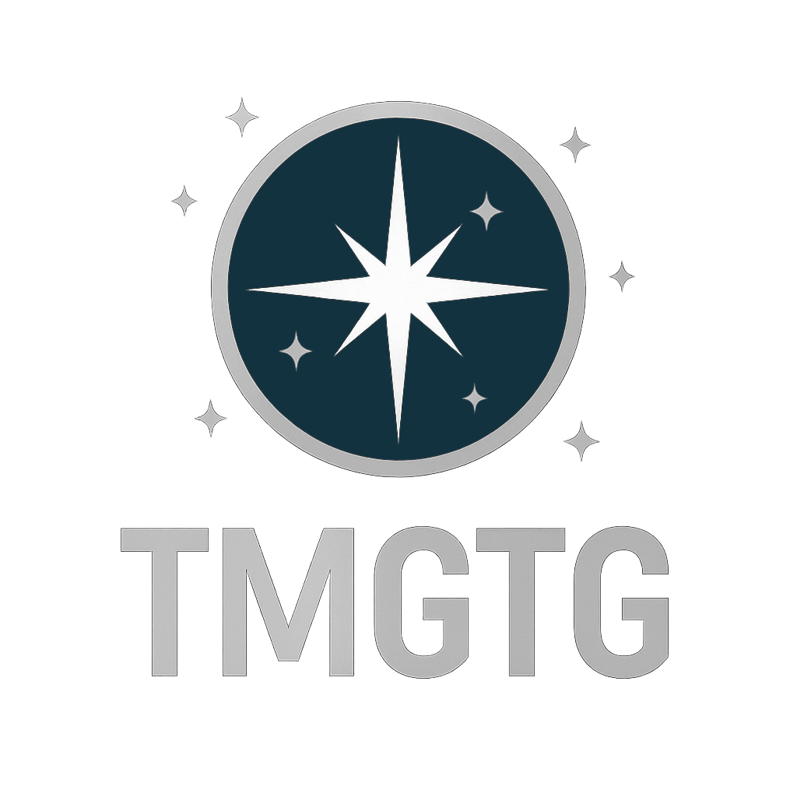

<p align="center">
  
</p>

# The Microlenser's Guide to the Galaxy
[](https://mybinder.org/v2/gh/AmberLee2427/TheMicrolensersGuideToTheGalaxy/HEAD?labpath=Notebooks%2FIntroduction.ipynb)
[](https://codespaces.new/AmberLee2427/TheMicrolensersGuideToTheGalaxy?devcontainer_path=.devcontainer%2Fdevcontainer.json)
Welcome, intrepid explorers of the cosmic tapestry! You are about to embark on a delightful journey through the realm of microlensing. This guide has been meticulously crafted to furnish the eager minds of budding scientists with the skills necessary to navigate the wonders of the Roman microlensing project.

## Overview
[](https://www.youtube.com/watch?v=b857l8PAllo)

## Table of Contents
- [Introduction](#introduction)
- [Installation](#installation)
- [Usage](#usage)
- [Developer Workflow](#developer-workflow)
- [Contributing](#contributing)
- [License](#license)
- [Contact](#contact)

## Introduction
Picture this: a galaxy brimming with mysteries and hoards of juicy Roman data waiting to unravel them. But this picture is missing something: a doe-eyed microlenser, whose fortitude and cleverness are up to the task of its unraveling—someone like you.

The goal of this project is to create an all-encompassing collection of Jupyter notebooks—your trusty companions for engaging exercises related to microlensing. Through these notebooks, the insights and experiences of microlensing elders can light your path as you embark on your journey of discovery and exploration through scientific research.

This guide follows a choose-your-own-adventure style. You control the specializations and knowledge you wish to become equipped with. That way, whether you are the min-maxing kind or more the type to vibe it out, this course is designed specifically for you.

These resources are made to be as freely available as HST time is not, beckoning anyone with a curious spirit to delve into the fascinating world of microlensing and contribute to its exciting development.

## Installation
To embark on your microlensing adventure, simply follow these straightforward steps:

1. Clone the repository:  
   ```bash
   git clone https://github.com/AmberLee2427/TheMicrolensersGuideToTheGalaxy.git
   ```
1. Create a dedicated environment with the required dependencies:
    ```bash
    sudo apt-get install python3-venv
    python3 -m venv <env-name>
    source <env-name>/bin/activate
    pip install -r requirements.txt
    ```
    for pip users on macOS or Linux,

    or

    ```bash
    conda env create --file=environment.yml
    conda activate TheGuide
    ```
    for Anaconda users. This notebook course currently runs on Python version 3.11.
    
    Alternatively, without using environments (not recommended), you can install the required dependencies as follows:  
    ```bash
    pip install -r requirements.txt
    ```
    for pip users,

    or 

    ```bash
    conda install --file requirements.txt
    ```
    for Anaconda users. Installs using the requirements file are untested

And voilà! You’re ready to launch into the universe of data and discovery.

If however, this installation process leaves you as maniacally depressed as the android, Marvin, save yourself some heartache and refer to the expertise of your institutions designated tech expert. If you continue to experience failures to launch, contact the project author. 

Some of the more specialised notebooks in this guide have further install requirements that we recommend you tackle on an as-needed basis.

## Usage

Open the Jupyter notebooks nestled within the `Notebooks` directory, where each document brims with exercises and illuminating examples. Follow the instructions inside your [`Introduction.ipynb`](Notebooks/Introduction.ipynb) ([GitHub link](https://github.com/AmberLee2427/TheMicrolensersGuideToTheGalaxy/blob/main/Notebooks/Introduction.ipynb)) notebook and prepare to explore the captivating concepts of microlensing with all the enthusiasm of a seasoned hitchhiker. 

## Run Online

- **Binder** launches a temporary JupyterLab workspace in the cloud. Click the badge above or visit the Binder link to open `Notebooks/Introduction.ipynb`; builds rely on the repo’s `environment.yml`/`requirements.txt`, so launches can take a minute on cold starts.
- **GitHub Codespaces** provisions a full VS Code environment with the repository pre-cloned and dependencies installed via `pip install -r requirements.txt`. Use the badge above (GitHub account required) for a persistent development workspace where you can run tests, rebuild docs, and commit changes.

## Developer Workflow

- **Reference directories** live under `Notebooks/Exercises/` (solved example blocks) and `Notebooks/Reset/` (blank learner prompts). Keep both in sync when you touch an exercise.
- **Generate solved notebooks for testing** with `python replacement.py Notebooks/<Notebook>.ipynb build/<Notebook>_solved.ipynb --keep`. Omitting the third argument defaults to `Notebooks/Exercises/`, so the solved blocks are injected automatically.
- **Restore the learner view before committing** using the reset prompts: `python replacement.py build/<Notebook>_solved.ipynb Notebooks/<Notebook>.ipynb Notebooks/Reset --keep`. This swaps the solved content back to the blank placeholders.
- **Refresh the reference blocks** after editing exercises:  
  `python solutions.py Notebooks/<Notebook>.ipynb Notebooks/Exercises --force` (for solved answers) and  
  `python solutions.py Notebooks/<Notebook>_blank.ipynb Notebooks/Reset --force` if you adjust the learner prompt itself. The `--force` flag lets the script overwrite its temporary export without manual prompts.
- **Verify changes** by running `pytest` and, if relevant, rebuilding docs via `python build.py` to ensure notebooks still execute end-to-end.

## Contributing

Your contributions are the hydrogen that makes this project shine brighter! If you wish to become an Author and enhance these resources—whether through bug fixes, clever improvements, or new exercises—please don’t hesitate to contact the project author at malpas.1@osu.edu. Every bit of input is appreciated.

### Authors
- Amber Malpas
- Katarzyna Kruszynska
- Alison Crisp
- Arjun Murlidhar
- Samson Johnson

## License

This project is released under the [MIT License](LICENSE). Fear not, for the original material within these resources, including code snippets, is free for use—like the best snacks on an interstellar flight. However, do keep in mind that any copyrighted material within the notebooks is bound by the restrictions of its original copyright holders.

## Citation

Malpas, A., Kruszynska, K., Crisp, A., Murlidhar, A., & Johnson, S. (2025). The Microlenser's Guide to the Galaxy (v0.1.0). Zenodo. https://doi.org/10.5281/zenodo.17437885
[](https://doi.org/10.5281/zenodo.17437885)

## Contact

Should questions or inquiries cross your mind or terminal, feel free to reach out to the project author, who is as approachable as a friendly as wait staff at the restaurant at the end of the Universe:

- **Name:** Amber Malpas
- **Email:** malpas.1@osu.edu
- **GitHub:** [AmberLee2427](https://github.com/AmberLee2427)

So raise you thumb, grab your towel, and prepare for an enlightening expedition into the universe of microlensing!
